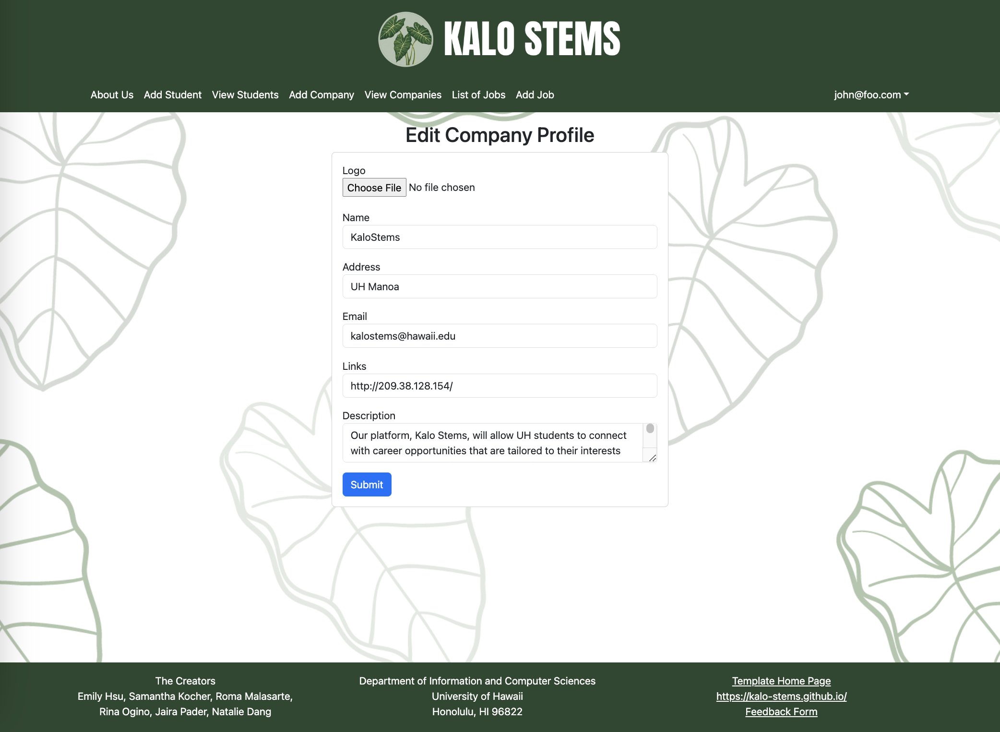
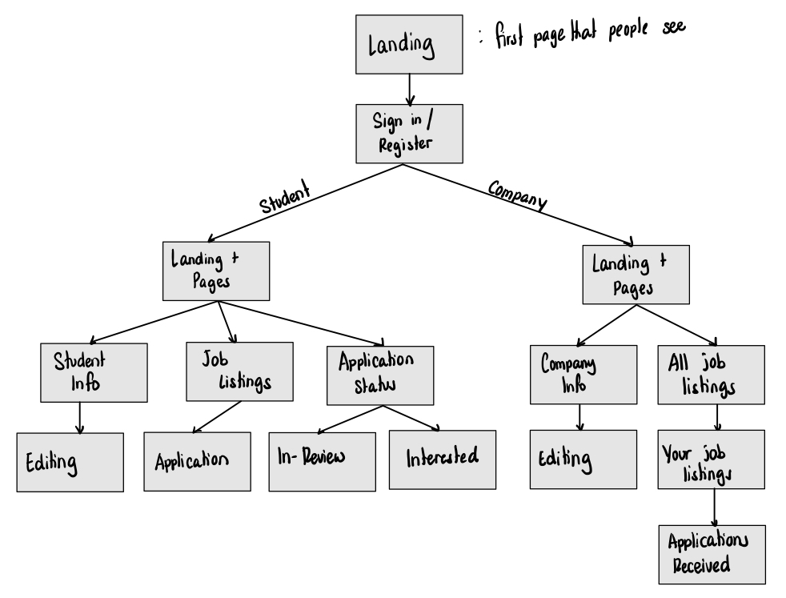

 

## Table of contents

* [Overview](#overview)
* [Deployment](#deployment)
* [User Guide](#user-guide)
* [Developer Guide](#developer-guide)
* [Development History](#development-history)
* [Links](#links)
* [Team](#team)
* [Community Feedback](#community-feedback)

## Overview

Our platform, Kalo Stems, will allow UH students to connect with career opportunities that are tailored to their interests and skills. Students will be able to specify their background and aspirations, allowing companies to view students who are the best fit for their opportunity. Kalo Stems bridges the gap between academia and industry, allowing students long-term professional success. This application will illustrate various technologies useful to ICS software engineering student, including: 

* [Meteor](https://www.meteor.com/) for Javascript-based implementation of client and server code.
* [React](https://react.dev/) for component-based UI implementation and routing.
* [React](https://react-bootstrap.github.io/) Bootstrap CSS Framework for UI design.
* [Uniforms](https://uniforms.tools/) for React and Semantic UI-based form design and display.

## Deployment
View our website application here: [Kalo Stems](http://146.190.131.126/)

## Activity Badges
[](https://github.com/kalo-stems/kalo-kode/actions/workflows/ci.yml)

## User Guide
This section provides a walkthrough of the Kalo Stems user interface and its capabilities.

### Landing Page
The landing page is presented to users when they visit the top-level URL to the site. It provides our motto and some previews of our application.


### Profile Pages
Kalo Stems has two types of profile pages: Company and Student, depending on the user's title.

**Company Profile** The Company Profile page contains the ability to add the following company information:


**Student Profile** The Student Profile page contains the ability to add the following information about the student, also linking to their LinkedIn and GitHub:


**Student Profile** The Jobs Profile page contains the ability to add the following information about the job and brief description:


*We intend to enhance the UI design over the course of our project.*

### Listing Pages
The list pages contain a vast amount of company profiles, and or opportunities for students to connect with, and the ability to hone in on best fit publications.

**Company List** The Company List page contains a variety of companies that are looking for potential matches, as well as contact information for students to easily connect with.


**Job List** The Job List page contains a variety of jobs that companies are offering, with brief descriptions, requirements, and wages. Students are one click away from the "Apply" button!


**Student List** The Student List page contains a list of students showcasing their skills and information for companies to look at and find their potential match.


### Editing Profile Pages
Each profile page (company and student) will have an implemented edit button that will direct them to a page where their information can be updated.

**Company Profile Edit** The company profile editing page contains the same information as the original company profile addition page, that can be updated anytime:



**Student Profile Edit** The student profile editing page contains the same information as the original student profile addition page, that can be updated anytime:


## Developer Guide
This section provides information of interest to Meteor developers wishing to use this code base as a basis for their own development tasks.

### Installation
First, [Install Meteor](https://docs.meteor.com/install.html).

Second, visit the [Kalo Stems application github page](https://github.com/kalo-stems/kalo-stems.github.io), and click the "Use this template" button to create your own repository initialized with a copy of this application. Alternatively, you can download the sources as a zip file or make a fork of the repo. However you do it, download a copy of the repo to your local computer ("clone" the file to your computer!).

Third, cd into the bowfolios/app directory and install libraries with:
```angular2html
$ meteor npm install
```

Fourth, run the system with:
```angular2html
$ meteor npm run start
```

If all goes well, the application will appear at [http://localhost:3000](http://localhost:3000).

### Application Design
Kalo Stems is based upon [meteor-application-template-react](https://ics-software-engineering.github.io/meteor-application-template-react/) and [meteor-example-form-react](https://ics-software-engineering.github.io/meteor-example-form-react/).  Please use the videos and documentation at those sites to better acquaint yourself with the basic application design and form processing in Kalo Stems.

### Data Model
This is our prototype Data Model in which we hope to base our collections off of. This is a design choice that we are currently working in progress.



## Development History 
The development process for Kalo Stems conformed to [Issue Driven Project Management](http://courses.ics.hawaii.edu/ics314f19/modules/project-management/) practices. In a nutshell:

* Development consists of a sequence of Milestones.
* Each Milestone is specified as a set of tasks.
* Each task is described using a GitHub Issue, and is assigned to a single developer to complete.
* Tasks should typically consist of work that can be completed in 2-4 days.
* The work for each task is accomplished with a git branch named "issue-XX", where XX is replaced by the issue number.
* When a task is complete, its corresponding issue is closed and its corresponding git branch is merged into master.
* The state (todo, in progress, complete) of each task for a milestone is managed using a GitHub Project Board.

The following sections document the development history of Kalo Stems.

### Milestone 1
The goal of Milestone 1 was to create a set of mockup pages for our app.

Milestone 1 is managed using [Kalo Stems GitHub Project Board M1](https://github.com/orgs/kalo-stems/projects/3).

### Milestone 2
The goal of Milestone 2 was to implement the data model: the underlying set of Mongo Collections and systems that would support the Kalo Stems application.

Milestone 2 is managed using [Kalo Stems GitHub Project Board M2](https://github.com/orgs/kalo-stems/projects/6).

### Milestone 3
The goal of Milestone 3, our final milestone, was to enhance the functionality and appearance of our application. We have also fixed all bug issues.

Milestone 3 is managed using [Kalo Stems GitHub Project Board M3](https://github.com/orgs/kalo-stems/projects/7).

## Continuous Integration
Kalo Stems uses [Github Actions](https://docs.github.com/en/free-pro-team@latest/actions) to automatically run ESLint and TestCafe each time a commit is made to the default branch.  You can see the results of all recent "workflows" at [https://github.com/kalo-stems/kalo-stems.github.io/actions](https://github.com/kalo-stems/kalo-stems.github.io/actions).

## Links
* [GitHub Organization](https://github.com/kalo-stems)
* [Team Contract](https://docs.google.com/document/d/1pQhVukBdsgP-iYddv36u0Z7tSdybe16vppzxzfB3U6Q/edit?usp=sharing)
* [Slideshow](https://www.canva.com/design/DAGBZoxKtCk/fQQk6ZFbjSCNc1vgeSsEIQ/edit)

## Team
Kalo Stems is designed and implemented by [Natalie Dang](https://ndang562.github.io/), [Emily Hsu](https://ehsugit.github.io/), [Samantha Kocher](https://samanthakocher.github.io/), [Roma Malasarte](https://romamalasarte.github.io/), [Rina Ogino](https://rinaogino.github.io/), and [Jaira Pader](https://jairabp.github.io/).

## Community Feedback
We are interested in your experience using Kalo Stems! Please take a couple of minutes to fill out the [Kalo Stems Feedback Form](https://docs.google.com/forms/d/e/1FAIpQLSe2SBh4m5ZspDTEs6nUZX3oFsPsw_8W-QFEuCeRV7GaNbes3g/viewform?usp=pp_url). It contains only a few short questions and will help us understand how to improve the system.

Here are some reviews from the UH community members who have used our app and given us feedback: [Kalo Stems Feedback Results](https://docs.google.com/spreadsheets/d/1QBgO--X2M2647mTi2rRfJNwD5UEX1XWcX1Uezlw8DFU/edit?usp=sharing)

*9/10: It's prettier than SECE. It literally feels more for the community than that blue gray theme SECE has. Needs more info though.*

*7/10: Simplistic and easy to navigate. please add more jobs. I dont like the jobs listed other than the money given.*

*8/10: The website was easy to navigate. I liked the simple aesthetics that was not too much for the eyes. Add the delete button, but website looks good.*

*7/10: I like that I was able to see others profiles and look for people that match skills with me. It felt like I was connecting with others.*

*9/10: I liked the theme and about us. I like how it fits will with hawaii. It is also an interesting concept to choose for a final project. It needs a bigger user base and I think this could go really well if there are more companies on here and jobs. It could eventually be better than SECE.*
